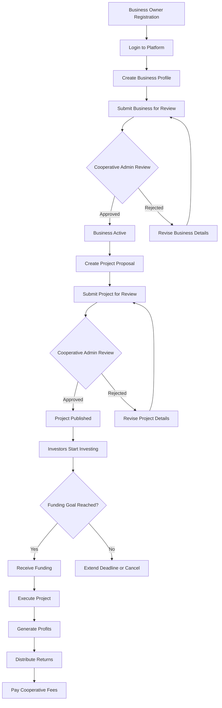
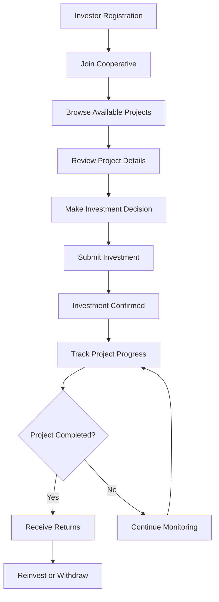
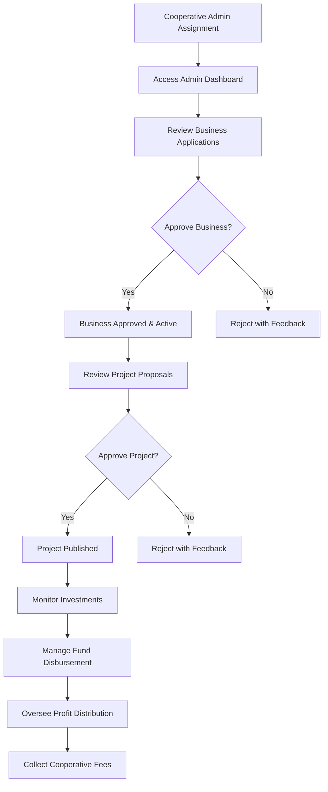

# 🔄 ComFunds Platform Workflow Documentation

This document provides detailed workflow diagrams and technical processes for the ComFunds cooperative investment platform.

## 📊 System Architecture Overview

```
┌─────────────────┐    ┌─────────────────┐    ┌─────────────────┐
│   Business      │    │   Cooperative   │    │   ComFunds      │
│   Owners        │    │   Admins        │    │   Admins        │
└─────────────────┘    └─────────────────┘    └─────────────────┘
         │                       │                       │
         │                       │                       │
         ▼                       ▼                       ▼
┌─────────────────────────────────────────────────────────────────┐
│                    ComFunds Platform                            │
│  ┌─────────────┐  ┌─────────────┐  ┌─────────────┐            │
│  │  Business   │  │  Project    │  │ Investment  │            │
│  │ Management  │  │ Management  │  │ Management  │            │
│  └─────────────┘  └─────────────┘  └─────────────┘            │
└─────────────────────────────────────────────────────────────────┘
         │                       │                       │
         │                       │                       │
         ▼                       ▼                       ▼
┌─────────────────┐    ┌─────────────────┐    ┌─────────────────┐
│   Cooperative   │    │    Investors    │    │    Members      │
│   Members       │    │                 │    │                 │
└─────────────────┘    └─────────────────┘    └─────────────────┘
```

---

## 🎯 Detailed User Workflows

### 1. Business Owner Complete Journey



### 2. Investor Complete Journey



### 3. Cooperative Admin Complete Journey



---

## 💰 Investment Cycle Detailed Flow

### Phase 1: Project Creation & Approval
```
Business Owner → Creates Project → Cooperative Admin Reviews → Project Approved → Published
```

**Detailed Steps:**
1. **Business Owner Actions:**
   - Logs into dashboard
   - Navigates to "Create Project"
   - Fills project details form
   - Uploads supporting documents
   - Sets funding goals and timelines
   - Submits for review

2. **Cooperative Admin Actions:**
   - Receives notification of new project
   - Reviews project documentation
   - Evaluates business viability
   - Checks funding requirements
   - Approves or rejects with feedback

3. **System Actions:**
   - Project status updated
   - Notifications sent to relevant parties
   - Project published on investment board (if approved)

### Phase 2: Investment Collection
```
Project Published → Investors Browse → Make Investments → Funds Accumulated
```

**Detailed Steps:**
1. **System Actions:**
   - Project appears on investment board
   - Funding progress tracker initialized
   - Investment notifications sent

2. **Investor Actions:**
   - Browse available projects
   - Review project details and risk assessment
   - Decide on investment amount
   - Submit investment through platform
   - Receive investment confirmation

3. **Tracking:**
   - Real-time funding progress updates
   - Investor portfolio updates
   - Project milestone tracking

### Phase 3: Fund Disbursement
```
Funding Goal Reached → Cooperative Admin Reviews → Funds Released → Project Execution
```

**Detailed Steps:**
1. **Trigger Events:**
   - Funding goal reached, OR
   - Funding deadline reached with minimum funding

2. **Cooperative Admin Actions:**
   - Final project review
   - Verify all documentation
   - Calculate and deduct cooperative fees
   - Authorize fund release

3. **Fund Transfer:**
   - Funds transferred to business account
   - Transaction records created
   - All parties notified

### Phase 4: Project Execution & Monitoring
```
Funds Received → Project Implementation → Progress Updates → Milestone Tracking
```

**Ongoing Activities:**
- Business owner provides regular updates
- Investors receive progress notifications
- Cooperative admin monitors project health
- System tracks milestone completion

### Phase 5: Profit Distribution
```
Project Generates Profit → Calculate Returns → Distribute to Investors → Cooperative Fees
```

**Distribution Process:**
1. **Business Owner:**
   - Reports project profits
   - Calculates investor returns based on profit-sharing agreement
   - Initiates profit distribution

2. **Cooperative Admin:**
   - Verifies profit calculations
   - Processes distribution requests
   - Deducts cooperative management fees
   - Authorizes investor payouts

3. **System:**
   - Calculates individual investor returns
   - Processes payments to investor accounts
   - Updates investment records
   - Generates distribution reports

---

## 🔐 Role-Based Access Control

### User Permission Matrix

| Feature | Member | Investor | Business Owner | Cooperative Admin | ComFunds Admin |
|---------|--------|----------|----------------|-------------------|----------------|
| View Projects | ✅ | ✅ | ✅ | ✅ | ✅ |
| Make Investments | ❌ | ✅ | ✅ | ❌ | ❌ |
| Create Business | ❌ | ❌ | ✅ | ❌ | ❌ |
| Create Projects | ❌ | ❌ | ✅ | ❌ | ❌ |
| Approve Businesses | ❌ | ❌ | ❌ | ✅ | ✅ |
| Approve Projects | ❌ | ❌ | ❌ | ✅ | ✅ |
| Manage Users | ❌ | ❌ | ❌ | ✅ | ✅ |
| System Administration | ❌ | ❌ | ❌ | ❌ | ✅ |

---

## 📋 Business Process Workflows

### Business Registration Workflow
```
1. Business Owner Registration
   ↓
2. Business Profile Creation
   ├── Basic Information (Name, Type, Description)
   ├── Legal Information (Registration, Tax ID)
   ├── Financial Information (Revenue, Bank Details)
   └── Documentation Upload
   ↓
3. Cooperative Admin Review
   ├── Document Verification
   ├── Business Viability Assessment
   └── Compliance Check
   ↓
4. Approval Decision
   ├── Approved → Business Active
   └── Rejected → Feedback & Revision Required
```

### Project Approval Workflow
```
1. Project Proposal Submission
   ├── Project Details (Title, Description, Goals)
   ├── Financial Planning (Funding Goal, Timeline)
   ├── Business Association
   └── Supporting Documents
   ↓
2. Cooperative Admin Evaluation
   ├── Project Feasibility Review
   ├── Risk Assessment
   ├── Business Owner Track Record
   └── Market Analysis
   ↓
3. Approval Process
   ├── Approved → Project Published
   ├── Conditional → Requires Modifications
   └── Rejected → Feedback Provided
```

### Investment Processing Workflow
```
1. Investment Request
   ├── Project Selection
   ├── Investment Amount
   └── Terms Acceptance
   ↓
2. Validation
   ├── User Authentication
   ├── Cooperative Membership Check
   ├── Available Funds Verification
   └── Investment Limits Check
   ↓
3. Processing
   ├── Fund Reservation
   ├── Investment Record Creation
   └── Confirmation Generation
   ↓
4. Tracking
   ├── Portfolio Update
   ├── Project Progress Monitoring
   └── Return Calculation
```

---

## 📊 Financial Flow Management

### Fee Structure
```
Investment Amount: $10,000
├── Cooperative Management Fee: 2% = $200
├── Platform Fee: 1% = $100
└── Net Investment: $9,700

Project Returns: $12,000
├── Business Owner Profit: 60% = $7,200
├── Investor Returns: 38% = $4,560
└── Cooperative Fee: 2% = $240
```

### Fund Management Process
1. **Investment Collection:**
   - Funds held in cooperative escrow account
   - Investment tracking and record keeping
   - Automated fund pooling

2. **Disbursement:**
   - Cooperative admin authorization required
   - Fee deduction before transfer
   - Business account verification

3. **Return Distribution:**
   - Profit-sharing calculation
   - Individual investor allocation
   - Automated payment processing

---

## 🚨 Error Handling & Edge Cases

### Common Scenarios

#### 1. Funding Goal Not Met
```
Timeline Expires → Check Minimum Funding
├── Minimum Met → Partial Funding Release
└── Minimum Not Met → Full Refund to Investors
```

#### 2. Project Failure
```
Project Fails → Loss Assessment
├── Partial Recovery → Distribute Remaining Funds
└── Total Loss → Investor Loss Documentation
```

#### 3. Business Owner Default
```
Default Detected → Cooperative Admin Intervention
├── Recovery Action → Asset Liquidation
└── Insurance Claim → Investor Protection
```

### System Safeguards
- **Multi-level Approval Process**
- **Fund Escrow Management**
- **Automated Compliance Checks**
- **Risk Assessment Algorithms**
- **Audit Trail Maintenance**

---

## 📈 Reporting & Analytics

### Available Reports

#### For Investors
- **Portfolio Performance Report**
- **Investment History Report**
- **Return Analysis Report**
- **Risk Assessment Report**

#### For Business Owners
- **Project Performance Report**
- **Funding Progress Report**
- **Investor Demographics Report**
- **Financial Summary Report**

#### For Cooperative Admins
- **Cooperative Performance Dashboard**
- **Member Activity Report**
- **Financial Flow Report**
- **Risk Management Report**

#### For ComFunds Admins
- **Platform Analytics Dashboard**
- **Multi-Cooperative Comparison**
- **System Performance Metrics**
- **User Engagement Analytics**

---

## 🔧 Technical Integration Points

### API Endpoints (Conceptual)
```
Authentication:
├── POST /auth/register
├── POST /auth/login
└── POST /auth/logout

Business Management:
├── POST /businesses
├── GET /businesses/{id}
├── PUT /businesses/{id}
└── DELETE /businesses/{id}

Project Management:
├── POST /projects
├── GET /projects
├── PUT /projects/{id}
└── POST /projects/{id}/approve

Investment Management:
├── POST /investments
├── GET /investments/user/{id}
├── GET /investments/project/{id}
└── POST /investments/{id}/returns
```

### Database Schema (Key Tables)
```
Users
├── id, name, email, phone, address
├── roles[], cooperative_id
└── created_at, updated_at

Businesses
├── id, name, type, description
├── owner_id, cooperative_id
├── approval_status, documents
└── financial_info

Projects
├── id, title, description, business_id
├── funding_goal, current_funding
├── deadline, approval_status
└── profit_sharing_percentage

Investments
├── id, project_id, investor_id
├── amount, investment_date
├── status, expected_return
└── actual_return, return_date
```

---

## 📞 Support & Escalation

### Support Hierarchy
```
Level 1: User Self-Service
├── User Guide Documentation
├── FAQ Section
└── Platform Tutorials

Level 2: Cooperative Admin Support
├── Member Issues
├── Business/Project Approvals
└── Investment Disputes

Level 3: ComFunds Platform Support
├── Technical Issues
├── System Problems
└── Complex Disputes

Level 4: Platform Administration
├── System Configuration
├── Major Issues
└── Policy Decisions
```

---

*This workflow documentation provides comprehensive coverage of all platform processes and is intended for technical teams, administrators, and advanced users who need detailed understanding of system operations.*

**Document Version**: 1.0  
**Last Updated**: January 2025  
**Maintained By**: ComFunds Technical Team
